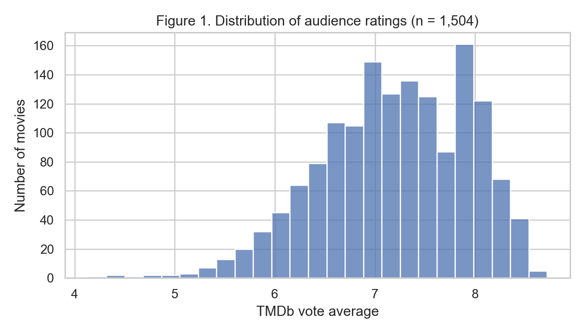
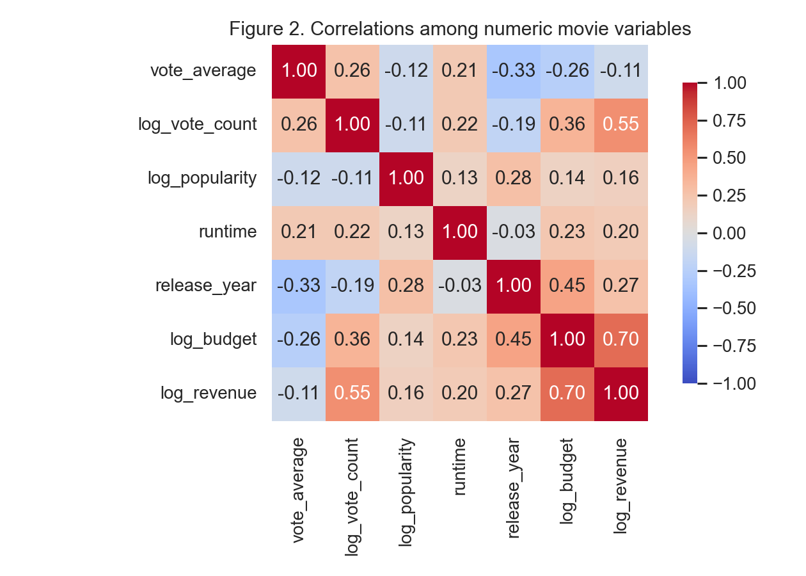
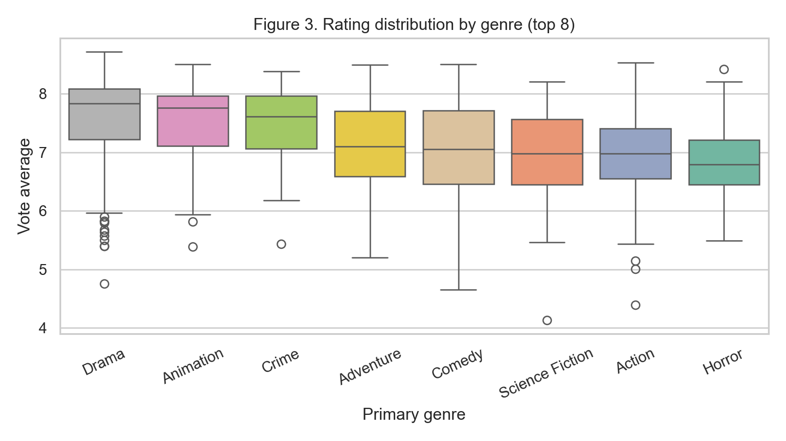
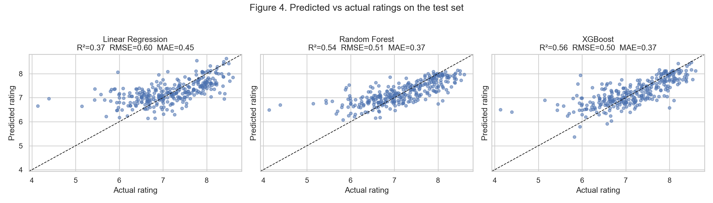
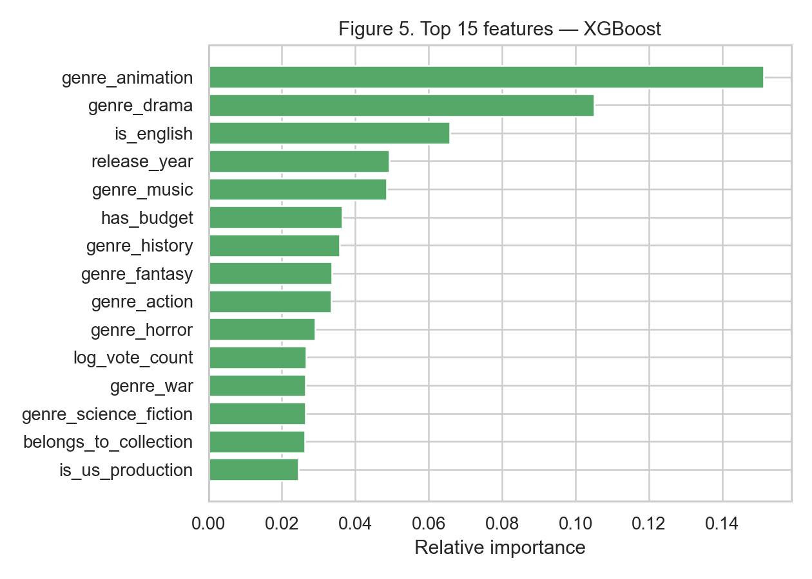
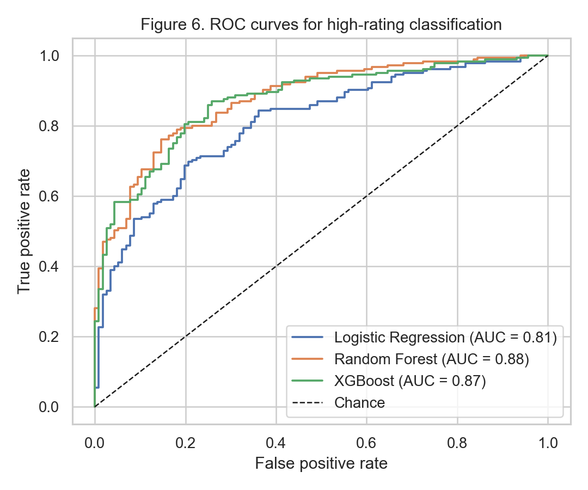

```{python}
#| label: setup
import pandas as pd
from pathlib import Path
TBL = Path("tables")
def load(name): return pd.read_csv(TBL / name, index_col=0)
t1 = load("table1_main_summary.csv")
t2 = load("table2_financial_summary.csv")
t3 = load("table3_regression.csv")
t4 = load("table4_classification.csv")
t5 = pd.read_csv(TBL / "table5_feature_importance.csv")
```

# Introduction

Online movie databases like TMDb collect a lot of metadata for every film:
ratings, vote counts, popularity scores, runtime, genre, budget, revenue.
On the surface these variables look like they should explain audience
ratings, but my midterm exploratory analysis on 148 movies showed otherwise.
Popularity was almost uncorrelated with rating. Budget and revenue were
strongly tied to each other but barely related to rating. Genre medians
differed but the distributions overlapped a lot. Nothing obvious popped
out as a strong rating predictor on its own.

That left an open question for the final: if no single variable explains
ratings, can a model that combines all of them do better? This report
takes the same TMDb data source and asks it as a prediction problem.

I focus on two questions:

1. *Regression.* How accurately can I predict TMDb's `vote_average`
   from a film's metadata using methods covered in JSC370?
2. *Classification.* Using the same features, can I tell whether a film
   will be high-rated (rating at least 7.0) on a held-out test set?

For both, I compare a linear baseline against Random Forest and XGBoost
and look at which features the trees rely on most.

# Methods

## Data collection

All data comes from The Movie Database public REST API.[^1] The midterm
used the `/movie/popular` endpoint, which kept returning the same
currently-trending titles and gave me only 148 usable rows after I
filtered out movies with too few votes. For the final, I switched to
`/discover/movie` and combined five sort strategies to get a wider
sample: most popular post-2015, most popular pre-2015, most-voted overall,
top-rated, and highest grossing. After deduplicating on TMDb's `id` and
filtering to movies with at least 30 votes, the final dataset has roughly
1,500 films. Per-movie details (budget, runtime, genres, production
companies, etc.) come from `/movie/{id}`. The collection script
(`collect_data.qmd`) is fully reproducible.

[^1]: <https://developer.themoviedb.org/reference/intro/getting-started>

## Cleaning and feature engineering

Numeric fields were coerced to floats. TMDb stores `0` for unknown
budget, revenue, and runtime, so I recoded those zeros as missing.
Following the midterm convention I dropped films with fewer than 30
votes, since their average ratings are too noisy to model.

Engagement and financial variables span several orders of magnitude, so
I log-transformed `vote_count`, `popularity`, `budget`, and `revenue`.
The `genres` field comes back from TMDb as a list of objects, which I
expanded into 18 binary indicators (one per common genre) plus a
`primary_genre` categorical and a count of genre tags per film.
Production countries were turned into a count plus a US-production flag.
Two missing-value flags (`has_budget`, `has_revenue`) preserve the fact
that a film has no reported financial data, since "budget unknown" is
itself informative. Decade and release month came from `release_date`.
Detailed code is in `analysis.qmd`. After feature engineering each
film has roughly forty numeric and indicator features.

@tbl-summary-main and @tbl-summary-fin report descriptive statistics for
the cleaned dataset.

```{python}
#| label: tbl-summary-main
#| tbl-cap: "Summary statistics for the main analysis dataset."
from IPython.display import Markdown
Markdown(t1.to_markdown())
```

```{python}
#| label: tbl-summary-fin
#| tbl-cap: "Summary statistics for the financial subset (films with positive budget *and* revenue)."
Markdown(t2.to_markdown())
```

## Modelling protocol

I split the data 60/20/20 into training, validation, and test sets, with
`random_state=370` for reproducibility. The classification target is
stratified across the three splits.

For **regression** I fit three models:

* Linear regression on median-imputed features. This is a parametric
  baseline that ignores feature interactions.
* Random forest with 500 trees, no maximum depth, and a minimum leaf
  size of 2. Bagging plus random feature subsetting at each split
  decorrelates the trees and lowers variance.
* XGBoost with 600 boosting rounds, learning rate 0.05, max depth 5,
  row and column subsampling at 0.8, and L2 regularisation $\lambda = 1$.
  I monitored the validation set during training. Boosting fits trees to
  the gradient of the loss, so it tends to capture interactions more
  efficiently than a plain forest at the same capacity.

I report $R^2$, $\mathrm{RMSE}=\sqrt{\frac{1}{n}\sum(y_i-\hat y_i)^2}$,
and $\mathrm{MAE}=\frac{1}{n}\sum |y_i-\hat y_i|$ on the held-out test
set.

For **classification** the target is `is_high_rated` =
$\mathbb{1}\{\text{vote\_average} \geq 7.0\}$. I fit logistic regression
as a baseline, plus random forest and XGBoost classifiers. The forest
uses `class_weight="balanced"` and XGBoost uses `scale_pos_weight` to
correct for the imbalance between high and low ratings. I report
accuracy, ROC AUC, and the test-set ROC curve (@fig-roc).

# Results

## Exploratory recap

@fig-rating-dist confirms the midterm finding that ratings cluster near
6.5 and rarely go below 5 or above 8. @fig-corr extends the midterm
correlation matrix to the engineered numeric features. `log_vote_count`
and `log_popularity` are weakly positively correlated with rating
(around 0.2 to 0.3); `log_budget` and `log_revenue` remain strongly
correlated with each other (around 0.7) but only weakly with rating.
@fig-genre-box shows that median ratings differ by genre — animation,
history, and documentary tend higher; horror tends lower — but
within-genre spread is wide and overlaps a lot.

{#fig-rating-dist width=80%}

{#fig-corr width=85%}

{#fig-genre-box width=90%}

## Regression performance

@tbl-regression compares the three regressors on the test set. Both
tree-based models beat the linear baseline by a clear margin; XGBoost
edges out random forest on every metric, but the gap between them is
small (about one percentage point on $R^2$ and 0.01 on RMSE).
@fig-pred-vs-actual plots predicted versus actual ratings for each
model. The linear baseline pulls predictions toward the mean (the
shrinkage effect of squared-error linear regression). XGBoost's
predictions hug the 45-degree line more tightly, especially in the
middle of the rating range. All three models tend to underpredict
the very top of the rating scale, which is hard to fit with so few
examples up there.

```{python}
#| label: tbl-regression
#| tbl-cap: "Test-set regression metrics. Lower RMSE and MAE are better; higher $R^2$ is better."
Markdown(t3.to_markdown())
```

{#fig-pred-vs-actual width=100%}

@fig-feat-importance shows the top 15 features ranked by XGBoost gain.
Categorical features dominate. `genre_animation` is by far the strongest
predictor, followed by `genre_drama`, `is_english`, `release_year`,
and `genre_music`. Several other genre indicators (history, fantasy,
action, horror) and structural flags (`has_budget`,
`belongs_to_collection`, `is_us_production`) follow close behind.
Engagement features (`log_vote_count`, `log_popularity`) sit in the
middle of the ranking rather than at the top. The midterm exploratory
analysis already showed that median ratings differ noticeably across
genres; the model is leaning on those genre and language differences,
combined with release year, to separate higher-rated films from the
rest.

{#fig-feat-importance width=85%}

## Classification performance

@tbl-classification reports test-set accuracy and ROC AUC for the
high-rating task. Tree-based models again come out ahead. XGBoost has
the highest accuracy, while random forest has the highest ROC AUC,
and the two are essentially tied — both sit in the mid-to-high 0.8s
on AUC, well above the logistic baseline. @fig-roc plots the full
ROC curves; the random forest and XGBoost lines are difficult to
separate visually for most threshold ranges.

```{python}
#| label: tbl-classification
#| tbl-cap: "Test-set classification metrics for predicting `vote_average ≥ 7.0`."
Markdown(t4.to_markdown())
```

{#fig-roc width=70%}

# Conclusions and Summary

So can audience ratings be predicted from public TMDb metadata? Yes,
to a meaningful extent. Tree-based ensembles beat linear baselines on
both the regression and classification versions of the question.
XGBoost and random forest are roughly tied — XGBoost is marginally
ahead on regression and classification accuracy, while random forest
nudges ahead on ROC AUC. On the larger 1,500-film sample, the trees
reach $R^2 \approx 0.55$ on the continuous rating and ROC AUC near
0.87 on the high-rating task.

The story about *which* features carry the signal looks different
from what the midterm hinted at. Genre indicators (animation, drama,
music) and language and recency variables (`is_english`,
`release_year`) sit at the top of the importance ranking, while
engagement signals (`log_vote_count`, `log_popularity`) — which
looked dominant in the smaller midterm sample — sit in the middle of
the pack here. The expanded sample brings in more films from across
genres, languages, and decades, and that diversity makes the
genre/language structure of TMDb ratings more visible to the model.

A few caveats are worth flagging. Vote count is a post-release
quantity, available at scoring time for any film already on TMDb but
not before release, which is the more commercially interesting
setting. A follow-up using only pre-release variables (cast,
director, budget, studio, genre, planned release date) would sharpen
the question. The dataset is also heavily skewed toward
English-language and US productions, which inflates the apparent
contribution of `is_english` and `is_us_production` and limits how
well the model would generalise to international cinema. And TMDb
ratings are themselves a self-selected sample — people who bother to
rate a film are not a random sample of viewers.

None of these caveats invalidate the main finding: TMDb metadata
contains real but limited rating signal, and tree ensembles use that
signal more efficiently than linear models do. Full source code, the
collection notebook, the analysis notebook, and the interactive
figures are all in the project GitHub repo and on the website.
